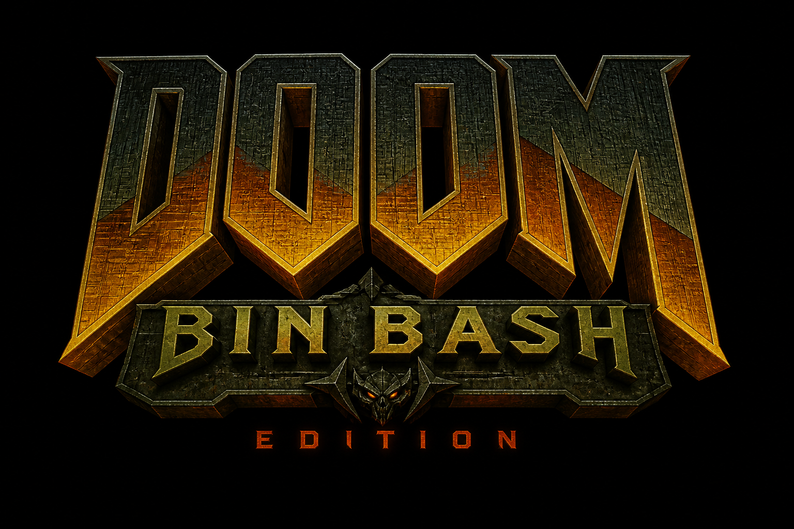

     1|<p align="center">
     2|  
     3|</p>
     4|
     5|# doom-bin-bash-edition
     6|
     7|**Browser-playable retro-horror raycast FPS** built with **Phaser 3**, **TypeScript**, and **Vite**. The **main product story** is **`RaycastScene`**: terminal prologue, **Episode 1** (five sectors + boss finale), optional **World 2** (four authored sectors) and **World 3** (three-sector ember arc when the progression allows), plus local **score / high score** and run summary. **`ArenaScene`** remains a **secondary** 2D sandbox for regression and local multiplayer — not the portfolio headline.
     8|
     9|**Engineering:** **Vitest** for core logic, **ESLint**, production **Vite** build, **GitHub Actions** CI.
    10|
    11|**Media:** Reference captures live under `docs/assets/`; this README stays text-first. A concrete capture wishlist is in [`docs/demo/screenshots-plan.md`](docs/demo/screenshots-plan.md).
    12|
    13|---
    14|
    15|## Disclaimer
    16|
    17|Portfolio / learning project. Inspired by the **feel** of classic retro FPS; **not** affiliated with Doom or Doom 64. No reuse of their code, assets, maps, names, sprites, sounds, or copyrighted content.
    18|
    19|## Clean-room boundary
    20|
    21|No copied gameplay assets, maps, proprietary data, or reverse-engineered implementations. References are **high-level only** (movement clarity, strafe play, pacing, readable horror atmosphere). Layouts, tuning, names, and visuals here are original.
    22|
    23|---
    24|
    25|## Implemented today (honest scope)
    26|
    27|What you can actually play and show:
    28|
    29|| Area | What ships |
    30||------|------------|
    31|| **Raycast renderer** | Column raycasting, procedural wall/floor styling, atmosphere (fog, corruption tint), billboards for pickups/doors/exits — **no** external texture packs. |
    32|| **Combat** | Hitscan weapons, damage feedback, enemy projectiles where authored, basic knockback/flash presentation hooks — **not** a full tactical sim. |
    33|| **AI director** | `GameDirector` pacing (calm → pressure → ambush → recovery, etc.) tuned per level; spawns and tension staging. |
    34|| **Encounters** | Authored beats, triggers, optional encounter-pattern hooks for variety — scope is **vertical slice**, not endless modes. |
    35|| **Enemy roles** | Kinds: `GRUNT`, `STALKER`, `RANGED`, `BRUTE`, `SCRAMBLER` with different silhouettes/roles in raycast presentation. |
    36|| **Boss** | Episode finale boss (e.g. **Volt Archon**) with phased fight and HUD strings; additional bosses in later worlds when reached. |
    37|| **Score / high score** | Run scoring, medals/rank where implemented, **localStorage** persistence — **no** server backend. |
    38|| **HUD / minimap** | Compact terminal-style HUD, objective line, combat strip, **M** minimap (see in-game help). |
    39|| **World progression** | Episode 1 catalog → boss → optional **World 2** / **World 3** continuation when unlock flow allows (banners and atmosphere differ per arc). |
    40|| **Quality gate** | `npm test`, `npm run lint`, `npm run build` expected green in CI and before releases. |
    41|
    42|**Arena (2D):** local sandbox — useful for tests and quick PvP/PvE; not where feature depth is concentrated.
    43|
    44|---
    45|
    46|## Roadmap / what this repo is *not*
    47|
    48|- **`docs/roadmap.md`** keeps a **historical** academic plan (early arena MVP). It does **not** define current scope.
    49|- **Active engineering direction:** phase notes under `docs/phases/` and [`docs/roadmap-next-block.md`](docs/roadmap-next-block.md).
    50|- This is a **vertical slice**: polish and clarity over infinite content or live ops.
    51|
    52|---
    53|
    54|## Quick start
    55|
    56|```bash
    57|npm ci
    58|npm run dev
    59|```
    60|
    61|Open the Vite URL (usually `http://localhost:5173`). From the menu: **`A`** or **“Press A: 3D Mode”** starts the raycast path (prologue → episode). **`B`** opens the 2D arena. **`D`** cycles raycast difficulty where supported.
    62|
    63|---
    64|
    65|## Controls
    66|
    67|| Context | Keys |
    68||---------|------|
    69|| **Menu** | **A** — raycast episode · **B** — 2D arena · **D** — cycle difficulty |
    70|| **Raycast** | Move **WASD** · Turn mouse / **Q** **E** / arrows · Fire **F** / Space / click · Weapons **1–3** · Map **M** · Restart **R** · Next **N** (when clear overlay) · **ESC** menu · **TAB** debug |
    71|| **Arena** | P1 **WASD** + **F** · P2 arrows + **L** · **R** restart |
    72|
    73|---
    74|
    75|## Verification
    76|
    77|```bash
    78|npm test
    79|npm run lint
    80|npm run build
    81|```
    82|
    83|---
    84|
    85|## Documentation
    86|
    87|| Doc | Description |
    88||-----|-------------|
    89|| [docs/README.md](docs/README.md) | Documentation index |
    90|| [docs/architecture.md](docs/architecture.md) | Scenes, raycast modules, director, tests |
    91|| [docs/roadmap.md](docs/roadmap.md) | Historical roadmap (context only) |
    92|| [docs/demo/demo-script.md](docs/demo/demo-script.md) | **3–5 min** demo order (portfolio) |
    93|| [docs/demo/raycast-demo-script.md](docs/demo/raycast-demo-script.md) | Extended presenter script + QA pass |
    94|| [docs/demo/screenshots-plan.md](docs/demo/screenshots-plan.md) | Screenshot / GIF goals (no fake assets) |
    95|| [docs/demo/release-checklist.md](docs/demo/release-checklist.md) | Pre-release smoke, media, PR checklist |
    96|| [docs/assets/screenshots/SHOT_LIST.md](docs/assets/screenshots/SHOT_LIST.md) | Detailed shot list + capture notes |
    97|| [docs/playtest/raycast-feel-checklist.md](docs/playtest/raycast-feel-checklist.md) | Feel / regression notes |
    98|
    99|---
   100|
   101|## Demo (~3–5 minutes)
   102|
   103|1. **Menu** — raycast as default story; difficulty if needed.
   104|2. **Prologue → sector** — movement, fire, objective.
   105|3. **Combat + HUD/minimap** — one clean encounter.
   106|4. **Key / door / secret** — one progression beat.
   107|5. **Boss or finale** — if time (or show in a clip).
   108|6. **Run summary** — score, rank, continue.
   109|7. **World 2 teaser** — continue after boss when available; cold banner vs forge.
   110|
   111|Script: [docs/demo/demo-script.md](docs/demo/demo-script.md).
   112|
   113|---
   114|
   115|## Repository layout (abbrev.)
   116|
   117|```text
   118|src/game/scenes/       MenuScene, PrologueScene, RaycastScene, RaycastWorldLockedScene, ArenaScene
   119|src/game/raycast/      Map, levels, renderer, combat, enemy, HUD, episode, presentation, atmosphere, …
   120|src/game/systems/      GameDirector, encounter patterns, audio, input, …
   121|src/tests/             Vitest — raycast, combat, director, episode, …
   122|docs/                  Architecture, demo scripts, release checklist, phase notes, assets
   123|```
   124|
   125|Details: [docs/architecture.md](docs/architecture.md).
   126|
   127|---
   128|
   129|## Stack
   130|
   131|Phaser 3 · TypeScript · Vite · Vitest · ESLint · Prettier · GitHub Actions ([`.github/workflows/ci.yml`](.github/workflows/ci.yml))
   132|
   133|---
   134|
   135|## Technical highlights
   136|
   137|- **Raycast column pipeline** with authored maps and level data (no commercial map packs).
   138|- **Separation** of presentation (`RaycastPresentation`, `RaycastRunSummary`, atmosphere options) from simulation.
   139|- **`GameDirector`** + encounter helpers testable where logic stays pure.
   140|- **World 2 / 3** as data modules (`RaycastWorldTwoLevels.ts`, `RaycastWorldThreeLevels.ts`) integrated from the level entry points.
   141|- **No backend** — high score and progress cues are **local**.
   142|
   143|---
   144|
   145|## License
   146|
   147|No `LICENSE` file is shipped in this snapshot; treat as **all rights reserved** / private portfolio unless the maintainer adds an explicit license.
   148|