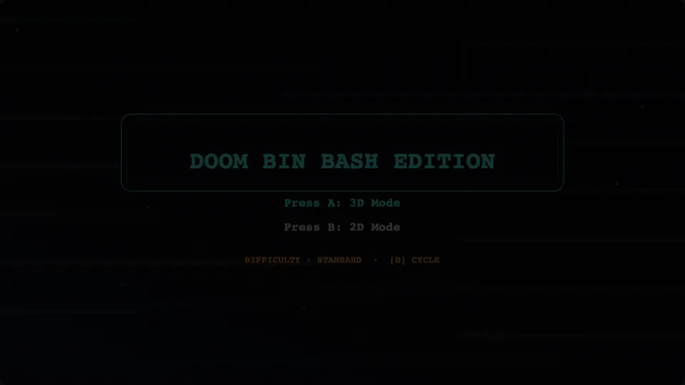
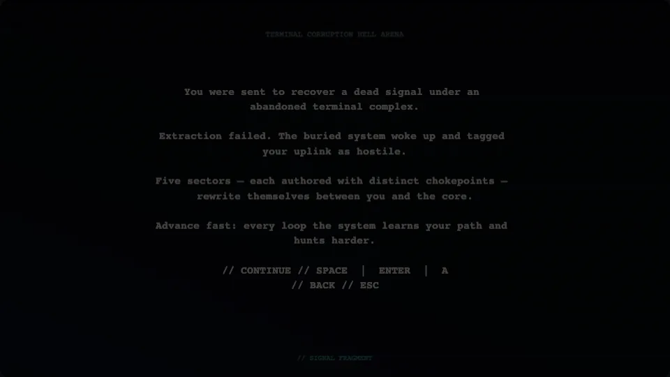
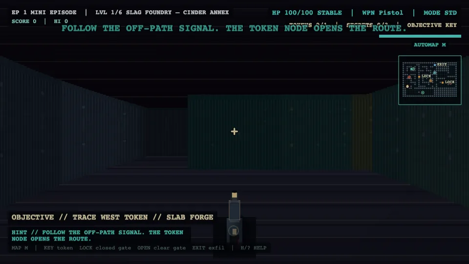
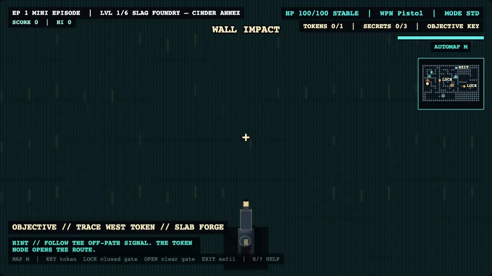
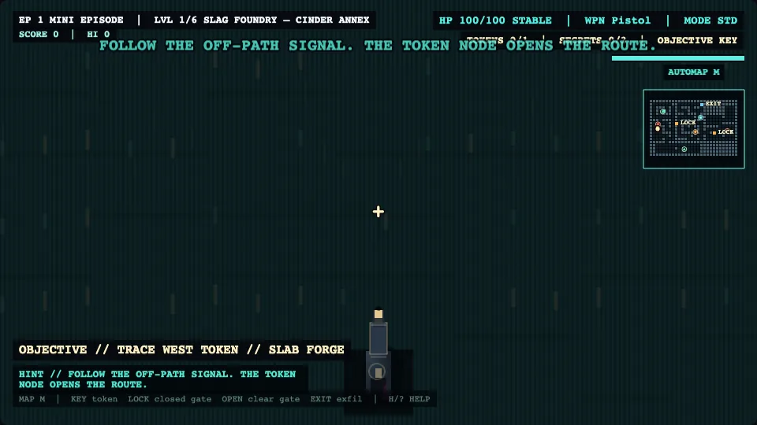
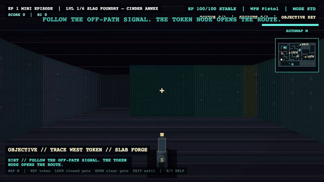

<p align="center">
  
</p>

# doom-bin-bash-edition

**Retro-horror raycast FPS** — a **browser-playable** vertical slice built with **Phaser 3**, **TypeScript**, and **Vite**. **`RaycastScene`** is the pitch: Episode 1 (five sectors + boss), optional **World 2** abyss arc (**four** data-driven sectors), **`GameDirector`** pacing, HUD / minimap, sector reports with score and rank, and generated WebAudio. **`ArenaScene`** is a **secondary** 2D sandbox for regression coverage.

**Status:** Portfolio-ready — core logic covered by **Vitest**, ESLint, production **Vite** build, GitHub Actions CI.

**Showcase:** Everything in **Gameplay preview** is a **live capture** (960×540, no UI chrome). Regenerate stills and GIFs with **`npm run capture:media`** ([`scripts/capture-portfolio.mjs`](scripts/capture-portfolio.mjs)). Moodboard images at the bottom are style references only.

---

## Gameplay preview

<p align="center">
  
  &nbsp;
  
  &nbsp;
  
</p>

<p align="center">
  
  &nbsp;
  
</p>

<p align="center">
  
  &nbsp;
  
</p>

<p align="center"><sub>Portfolio stills (5× WebP) ~97 KB total · GIFs ~230 KB + ~265 KB · Level-clear still (optional): <a href="docs/assets/screenshots/SHOT_LIST.md">SHOT_LIST.md</a> · Regenerate: <code>npm run capture:media</code> (script prints exact sizes)</sub></p>

---

## Disclaimer

Portfolio / learning project. Inspired by the **feel** of classic retro FPS titles; **not** affiliated with Doom or Doom 64. No reuse of their code, assets, maps, names, sprites, sounds, or copyrighted content.

## Clean-room boundary

No copied gameplay assets, maps, proprietary data, or reverse-engineered implementations. No content from DOOM64-RE. References are **high-level only** (movement clarity, strafe play, pacing, readable horror atmosphere). Layouts, tuning, names, and visuals in this repo are original.

---

## What ships today

- **Raycast episode:** menu → terminal prologue → **Episode 1** (five sectors + **Volt Archon** boss) → optional **World 2** four-sector rift (data-driven).
- **Gameplay:** WASD, mouse / keys look, hitscan weapons, doors / keys / secrets, ambush triggers, objectives, pause / death / clear flows.
- **Presentation:** Compact HUD, minimap, difficulty presets, sector report (score, high score, rank, timing, medals).
- **Systems:** `GameDirector` pacing (calm → pressure → ambush → recovery), enemy roles (`GRUNT`, `STALKER`, `RANGED`, `BRUTE`).
- **Quality:** Broad **unit tests** for raycast, combat, director, and presentation logic without requiring a live canvas.
- **Arena:** Local 2-player sandbox — preserved, not the primary pitch.

---

## Quick start

```bash
npm ci
npm run dev
```

Open the Vite URL (usually `http://localhost:5173`). From the menu: **`A`** or **“Press A: 3D Mode”** starts the raycast path (prologue → episode). **`B`** opens the 2D arena. **`D`** cycles raycast difficulty.

---

## Controls

| Context | Keys |
|---------|------|
| **Menu** | **A** — raycast episode · **B** — 2D arena · **D** — cycle difficulty |
| **Raycast** | Move **WASD** · Turn mouse / **Q** **E** / arrows · Fire **F** / Space / click · Weapons **1–3** · Restart **R** · Next **N** (when clear overlay) · **ESC** menu · **TAB** debug |
| **Arena** | P1 **WASD** + **F** · P2 arrows + **L** · **R** restart |

---

## Verification

```bash
npm run test
npm run lint
npm run build
```

---

## Documentation

| Doc | Description |
|-----|-------------|
| [docs/README.md](docs/README.md) | Documentation index |
| [docs/architecture.md](docs/architecture.md) | Raycast-first architecture |
| [docs/roadmap.md](docs/roadmap.md) | Historical roadmap + pointers |
| [docs/demo/raycast-demo-script.md](docs/demo/raycast-demo-script.md) | Presenter script (3–5 min and longer) |
| [docs/demo/release-checklist.md](docs/demo/release-checklist.md) | Pre-demo smoke checklist |
| [docs/assets/screenshots/SHOT_LIST.md](docs/assets/screenshots/SHOT_LIST.md) | Shot list for portfolio captures |
| [docs/phases/phase-32-portfolio-visual-polish.md](docs/phases/phase-32-portfolio-visual-polish.md) | Phase 32 — portfolio media & pipeline |

---

## Demo (about 4 minutes)

1. **Menu** — modes and difficulty (`D`).
2. **Prologue → sector 1** — movement, fire, objective line.
3. **Progression** — token, door, one combat pocket (HUD + director).
4. **Clear overlay** — sector report, score, rank; **ESC** to menu.

Full script: [docs/demo/raycast-demo-script.md](docs/demo/raycast-demo-script.md).

---

## Repository layout (abbrev.)

```text
src/game/scenes/       MenuScene, PrologueScene, RaycastScene, RaycastWorldLockedScene, ArenaScene
src/game/raycast/      Renderer, map, levels, combat, enemy, HUD, episode, presentation, …
src/game/systems/      GameDirector, audio, input, …
src/tests/             Vitest — raycast, combat, director, presentation, …
docs/                  Architecture, demo scripts, phase notes, portfolio assets
```

Details: [docs/architecture.md](docs/architecture.md).

---

## Stack

Phaser 3 · TypeScript · Vite · Vitest · ESLint · Prettier · GitHub Actions ([`.github/workflows/ci.yml`](.github/workflows/ci.yml))

---

## Technical highlights

- **Raycast column renderer** and authored maps / level data (no external map packs).
- **Separation** of presentation (`RaycastPresentation`, `RaycastRunSummary`) from simulation.
- **`GameDirector`** and pacing helpers covered by unit tests where logic is pure.
- **World 2** data in `RaycastWorldTwoLevels.ts` (re-exported from the level module).
- **No backend** — high score is **local** (`localStorage`).

---

## Visual inspiration (moodboard)

**Not gameplay.** Style reference only.

<p align="center">
  
</p>
<p align="center">
  
</p>
<p align="center">
  
</p>

---

## License

No `LICENSE` file is shipped in this snapshot; treat as **all rights reserved** / private portfolio unless the maintainer adds an explicit license.
