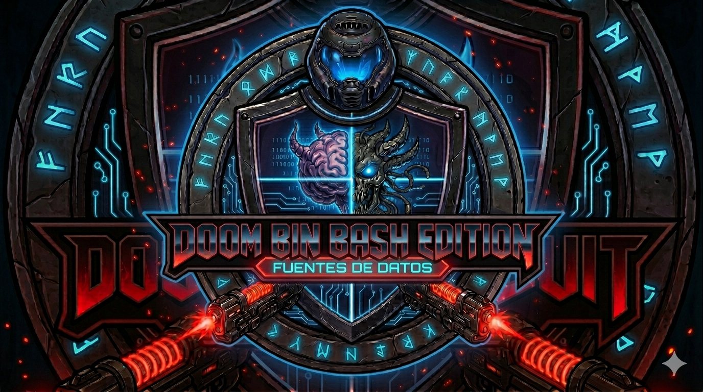
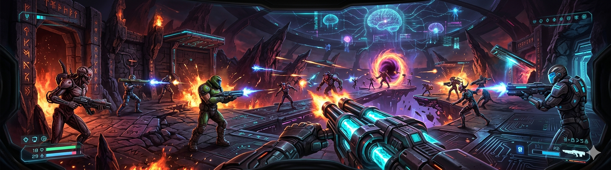
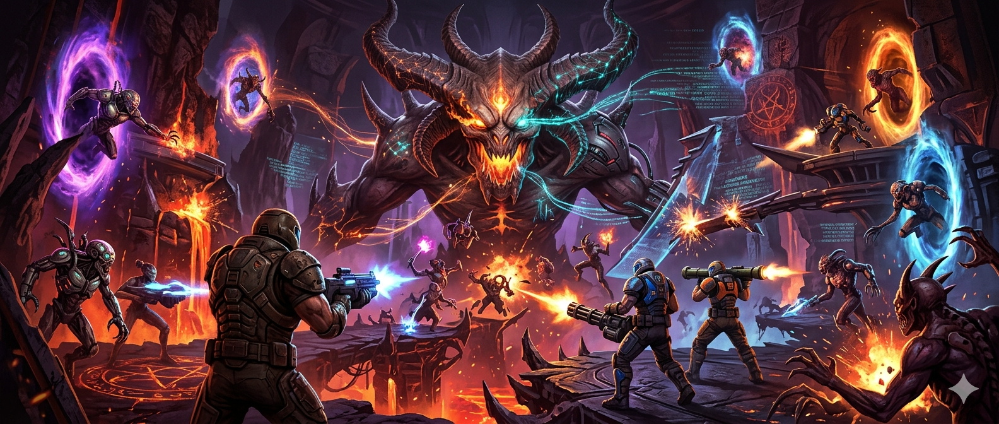
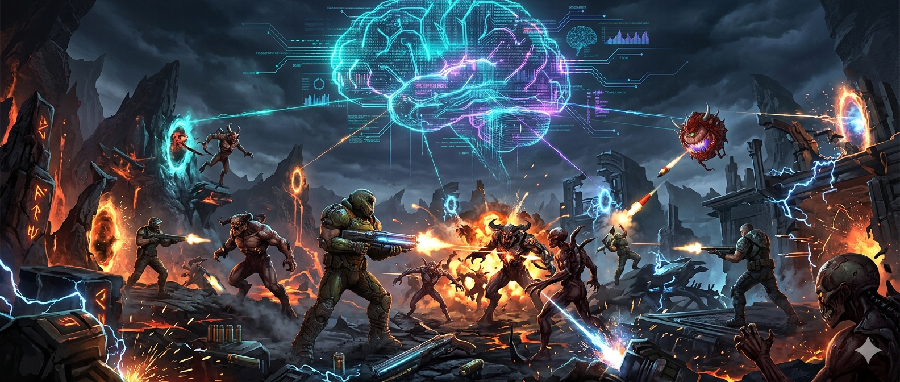

<p align="center">
  
</p>

# doom-bin-bash-edition

Original retro horror raycast FPS prototype built with Phaser 3, TypeScript, and Vite. The primary product direction is `RaycastScene`: a clean-room first-person mini episode with original levels, compact combat, and `GameDirector` pacing. `ArenaScene` remains available as a preserved secondary sandbox for the earlier 2D systems.

## Disclaimer

This is an original portfolio / learning project. It is inspired by the feel of classic retro FPS games, but it is not affiliated with Doom or Doom 64 and does not reuse their code, assets, maps, names, sprites, sounds, or copyrighted content.

## Clean-room / Original Content Boundary

This repository does not copy code, assets, maps, sounds, names, constants, proprietary data, or reverse-engineered implementations from existing games. It also does not use content from DOOM64-RE.

Reference points are limited to high-level feel goals such as fast movement, immediate input, strong strafe play, wide FOV, hitscan combat, ambush triggers, calm-to-chaos pacing, and a readable horror atmosphere. Code, tuning, layouts, visuals, audio, names, and gameplay data are original to this repo.

## Current Project

`doom-bin-bash-edition` currently presents a compact original raycast FPS vertical slice as the main experience. The gameplay is split across scenes, raycast modules, entities, and pure systems so the project stays testable and easy to hand off.

The current slice focuses on a short but complete flow: a menu, a two-level mini episode, objective-driven progression, generated audiovisual feedback, and a `GameDirector` that shapes pressure without requiring a large content footprint.

## Current Features

- `RaycastScene` como modo principal FPS/raycast.
- `GameDirector` pacing that shifts between calm, warning, pressure, ambush, and recovery states.
- Two linked original raycast levels presented as a mini episode.
- First-person movement with `WASD`, mouse / key turning, instant fire, and weapon switching.
- Doors, keys, secrets, and ambush triggers that support short guided runs.
- Compact HUD with health, weapon, token, secret, objective, and critical messaging.
- Level-clear, episode-clear, retry, and menu-return flows.
- Generated WebAudio feedback with no external sound files.
- `ArenaScene` preserved as a secondary 2D sandbox for legacy systems and regression safety.
- Movimiento first-person con `WASD`, giro con flechas/`Q`/`E`, strafe central y cámara horizontal.
- Mouse turn horizontal con pointer lock al hacer click dentro del canvas.
- Render raycast con atmósfera oscura, contraste jugable y billboards.
- Combate con disparo instantáneo, auto-aim permisivo, feedback de muzzle flash, hit flash, impactos y cambio de armas.
- Enemigos simples pero peligrosos en grupo, con daño al jugador, windup visible y proyectiles enemigos.
- Puertas, llaves, secretos, zonas y triggers de emboscada.
- Catálogo compacto de niveles raycast con dos mapas originales enlazados como mini episodio.
- HUD raycast compacto con vida, arma, tokens, secretos, objetivo, mensajes críticos y debug oculto por toggle.
- Loop completo con `SIGNAL LOST`, retry por nivel, avance al siguiente mapa y cierre de episodio con resumen final.
- Audio básico generado con WebAudio, opcional y sin archivos externos.
- `ArenaScene` conservada como modo secundario/sandbox 2D.
- Arena responsive/fullscreen con dos jugadores locales y combate PvP + PvE.
- Proyectiles, daño, muerte de jugadores/enemigos y reinicio de arena en el modo 2D.
- Arquetipos de enemigos: `GRUNT`, `BRUTE`, `STALKER`, `RANGED`.
- Siluetas diferenciadas por arquetipo usando primitives de Phaser.
- FSM simple de enemigos con estados `SPAWN`, `CHASE`, `ATTACK`, `DEAD`.
- Spawn pacing adaptativo según tiempo, kills, vida y enemigos vivos.
- Spawn telegraph visual antes de crear enemigos nuevos en sistemas 2D.
- Límite de enemigos vivos y presupuesto finito de spawns.
- Estado mínimo de partida: `GAME_OVER` y `ROUND_CLEAR`.
- Cleanup de proyectiles por bounds/lifetime.
- HUD de arena con barras de vida, kills, enemigos vivos/derrotados, estado e intensidad del director.
- Feedback visual: hit flash, muzzle flash, death burst, screenshake sutil y arena decorativa.
- Tests de lógica crítica para raycast, combate, FSM, configuración de enemigos, TargetSelector, audio config y GameDirector.

## Controls

- Menú: `SPACE` inicia `RaycastScene`; `A` abre `ArenaScene`.
- Raycast: mover con `WASD`; girar con mouse horizontal, flechas izquierda/derecha o `Q`/`E`; disparar con `F`, `SPACE` o click; cambiar arma con `1`/`2`/`3`; `R` reinicia el nivel actual; `N` avanza al siguiente nivel cuando el clear overlay está activo; `ESC` vuelve al menú; `TAB`/backtick alterna debug.
- Arena secundaria: `R` reinicia arena; Player 1 mueve con `WASD` y dispara con `F`; Player 2 mueve con flechas y dispara con `L`.

## Stack Técnico

- Phaser 3
- TypeScript
- Vite
- Vitest
- ESLint
- Prettier
- GitHub Actions para CI básico

## Arquitectura

```text
src/
  game/
    scenes/
      MenuScene.ts
      RaycastScene.ts
      ArenaScene.ts
    raycast/
      RaycastRenderer.ts
      RaycastMap.ts
      RaycastLevel.ts
      RaycastMovement.ts
      RaycastCombatSystem.ts
      RaycastEnemy.ts
      RaycastHud.ts
      RaycastRunSummary.ts
    entities/
      Player.ts
      Enemy.ts
      Projectile.ts
      enemyConfig.ts
    systems/
      CombatSystem.ts
      EnemyFSM.ts
      GameDirector.ts
      HUDSystem.ts
      InputManager.ts
      TargetSelector.ts
      AudioFeedbackSystem.ts
  tests/
    combat.test.ts
    raycast-combat.test.ts
    raycast-level.test.ts
    raycast-map.test.ts
    raycast-movement.test.ts
    enemy-config.test.ts
    enemy-fsm.test.ts
    game-director.test.ts
    target-selector.test.ts
    audio-feedback.test.ts
```

- `scenes`: coordinan el flujo visual y de gameplay (`MenuScene`, `RaycastScene`, `ArenaScene`).
- `raycast`: contiene renderer, mapa, nivel, movimiento, combate, enemigos y HUD del modo FPS.
- `entities`: representan objetos jugables y de combate del modo 2D (`Player`, `Enemy`, `Projectile`).
- `systems`: contienen lógica aislada como daño, input, HUD, FSM, puertas, llaves, triggers y dirección de spawns.
- `GameDirector`: calcula intensidad, decide si spawnear, respeta límites y selecciona tipo de enemigo en sistemas testeables.
- `TargetSelector`: elige el jugador vivo más cercano con lógica pura y testeable.
- `AudioFeedbackSystem`: genera cues cortos con WebAudio y falla de forma segura si el navegador bloquea audio.
- `tests`: cubren lógica pura para reducir riesgo sin depender de rendering de Phaser.

## Run And Verify

```bash
npm ci
npm run dev
```

Verification commands:

```bash
npm run test
npm run lint
npm run build
```

## Manual QA

- Demo script and handoff flow: [docs/demo/raycast-demo-script.md](docs/demo/raycast-demo-script.md)
- Pre-demo / pre-PR release checklist: [docs/demo/release-checklist.md](docs/demo/release-checklist.md)
- Raycast feel and regression checklist: [docs/playtest/raycast-feel-checklist.md](docs/playtest/raycast-feel-checklist.md)

## Technical Highlights

- **Phaser 3 + TypeScript:** vertical slice raycast/FPS con escenas, módulos raycast y sistemas separados.
- **RaycastScene primary:** entrada principal desde menú para probar movimiento, cámara horizontal, combate, nivel, triggers y atmósfera.
- **ArenaScene preserved:** modo 2D secundario para mantener compatibilidad con el sandbox local.
- **GameDirector:** controla ritmo y eventos de presión, además de spawn budget y límite de enemigos vivos.
- **Clean-room raycast feel:** movimiento inmediato, strafe fuerte, FOV amplio, disparo instantáneo, enemigos legibles, dos mapas originales con llave/puerta/emboscada/secreto/salida y atmósfera procedural original.
- **TargetSelector:** selección pura del jugador vivo más cercano, evitando targets muertos.
- **Game states:** `RUNNING`, `GAME_OVER` y `ROUND_CLEAR` con overlay claro y reinicio por `R`.
- **Critical logic tests:** cobertura de raycast, combate, FSM, configs de enemigos, selección de targets, audio config y director.
- **Quality gates:** `npm run test`, `npm run lint`, `npm run build` y CI básico con GitHub Actions.

## Visual Inspiration / Moodboard

Las imágenes siguientes son material visual local para presentación e inspiración de estilo. **Visual inspiration / moodboard, not gameplay screenshot.** No deben leerse como capturas reales del gameplay.

### Moodboard 1

<p align="center">
  
</p>

### Moodboard 2

<p align="center">
  
</p>

### Moodboard 3

<p align="center">
  
</p>

## Gameplay Screenshots

No hay screenshots reales del gameplay versionadas todavía en `docs/assets`. Cuando se agreguen capturas reales del juego, deben colocarse en esta sección y etiquetarse explícitamente como gameplay screenshots.

## Project Status

The project is currently a presentable raycast FPS vertical slice with a menu, two-level mini episode, generated audio, original progression content, and logic tests around critical systems. `ArenaScene` remains available as a secondary sandbox. The repo does not include copied maps, external commercial assets, bosses, online multiplayer, or large-scale progression systems.

## Roadmap por Fases

1. **Fase 0 - Reorientación raycast:** definir el target de feel FPS, boundary clean-room, README y menú con `RaycastScene` como foco.
2. **Fase 1 - Vertical Slice:** menú, arena, dos jugadores, disparos, daño, enemigos básicos, HUD y tests mínimos.
3. **Fase 2 - Enemigos y Director:** arquetipos `GRUNT`, `BRUTE`, `STALKER`, configuración testeable y `GameDirector` básico.
4. **Fase 3 - Hardening:** ampliar tests de lógica crítica, revisar tipos, lint, build y estabilidad.
5. **Fase 4 - Loop completo:** estado mínimo de partida, cleanup de proyectiles, target selection correcta y CI básico.
6. **Fase 5 - Polish de presentación:** feedback visual, HUD más claro, siluetas, arena decorativa, audio básico generado y README honesto.
7. **Fase 6 - Expansión futura:** contenido y sistemas nuevos marcados como próximos pasos.

## Próximos Pasos

- Playtest manual de `RaycastScene` para microajustes de ritmo, daño y distancia de spawns.
- Capturas reales del gameplay en `docs/assets`.
- Enemigos ranged y grupos más variados.
- Powerups originales.
- Polish adicional de efectos y sonido.
